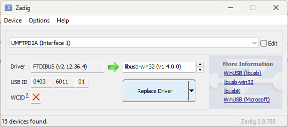
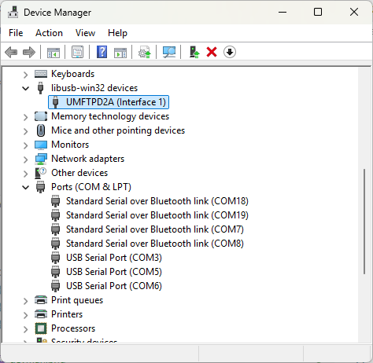

# Python BT82x Development

This python module and interface connectors allow python to be used to communicate with a BT82x device using D2XX, FT4232H, FT232H or FT4222H devices. 

## Setup

The FT4232H and FT232H methods use the **[MPSSE Interface](#mpsse-interface)** of the devices to communicate over SPI to the BT82x. The **[FT4222H Interface](#ft4222h-interface)** has built-in SPI hardware and controller. The D2XX method sends commands to an FT232H, FT4232H or FT232R device directly to drive the SPI interface.

The BT82X based module [VM820C](https://brtchip.com/product/vm820c/) is the main targeted hardware of this repo. 
It is equipped with [FT4222H Interface](#ft4222h-interface) on board for SPI connection with PC through USB.  
To work with MPSSE interface,  please refer to the [VM820C datasheet](https://brtchip.com/wp-content/uploads/2025/01/DS_VM820C-1.pdf)

### MPSSE Interface

For MPSSE devices the [pyftdi](https://github.com/eblot/pyftdi) module for python and the [libMPSSE-SPI](https://ftdichip.com/software-examples/mpsse-projects/libmpsse-spi-examples/) library are required. 

The **connector code** `"connectors/ft4232h.py"` is compatible with the [UMFTPD2A](https://brtchip.com/product/umftpd2a/) _(see note 1)_ module from Bridgetek,  whereas `"connectors/ft232h.py"` supports **USB-to-MPSSE** cables like the [VA800-SPI](https://www.digikey.com/en/htmldatasheets/production/1371434/0/0/1/va800a-spi) and [C232HM](https://ftdichip.com/products/c232hm-edhsl-0/).

The connector `ft4232h` supports the quad-channel FT4232H devices and the connector `ft232h` supports the single-channel FT232H devices.

_Note 1_: _A pin header and jumper cables are required to interface the CN2 connector to the BT82x development board._

#### Software Setup

All platforms will require a working up-to-date installation of __python 3.13.x__ or later. These instructions assume the use of __pip__ to install required pyftdi package.

```
pip install pyftdi
```

This code may also be used with [circuitpython](https://circuitpython.org/), however __this is not yet supported__.

#### Windows Setup

To connunicate with the MPSSE interface on Windows the standard FTDI drivers cannot be used. These must be replaced with a libusb driver in order for pyftdi to access the device directly. It is not necessary to replace the drivers for all the interfaces on the FTDI devices, just the one used for MPSSE.

The [Zadig](https://zadig.akeo.ie/) utility is a handy utility that will replace a driver with libusb. Click on the menu item "Options", then "List all Devices". For a UMFTPD2A board,from the drop-down box select __UMFTPD2A (Interface 1)__ and for the driver choose __libusb-win32__, then click "Replace Driver".



It may be neccessary to reboot the PC or remove and replug the MPSSE device. Once this is done the interface for the device will show in Windows Device Manager. Note that there is a missing USB Serial Port (COM4) now.



#### Linux Setup

*These instructions are incomplete!* The built-in Linux drivers for FTDI devices need to be disabled for the libusb driver to be invoked.

#### Hardware Setup

_MPSSE Bus numbers refer to the MPSSE interface signals._

The header on the BT82x board has the following connections:

| Pin | Name | Description |
| --- | ----- | ---- |
| 1 | SCK  | SPI SCK - Clock |
| 2 | CS#  | SPI CS# Serial Chip Select signal, active LOW |
| 3 | MOSI  | SPI MOSI - Master Out Slave In |
| 4 | MISO  | SPI MISO - Master In Slave Out |
| 5 | INT#  | Interrupt signal from BT82x, active LOW |
| 6 | RESET#  | Powerdown signal from SPI host, active LOW |
| 7 | NC  | no connection |
| 8 | NC  | no connection |
| 9 | GND  | Signal GND for SPI |
| 10 | GND  | Signal GND for SPI |

#### MPSSE Cables

For an MPSSE cable use the MPSSE SPI connections as per [Application Note AN_188](https://ftdichip.com/wp-content/uploads/2020/07/AN_188_C232HM_MPSSE_Cable_in_USB_to_SPI-Interface.pdf).

The following cable coloured wires are connected to the BT82x development board:

| Bus | Cable | Name |
| --- | ----- | ---- |
| MPSSE0 | SK (Orange)    | SPI SCK - Clock|
| MPSSE1 | DO (Yellow)    | SPI MOSI - Master Out Slave In |
| MPSSE2 | DI (Green)     | SPI MISO - Master In Slave Out |
| MPSSE3 | CS (Brown)     | SPI CS# - Serial Chip Select signal |
| MPSSE7 | GPIO L3 (Blue) | PD# - Powerdown signal |
| N/A    | GND (Black)    | Signal GND for SPI |

#### UMFTPD2A Programming Boards

On UMFTPD2A the CN2 connector is a 12-pin 2.54 mm pitch through hole connector. It is recommended that a through hole pin header is soldered into the connector and short male-to-male jumper cables used to connect to the BT82x board. The CN2 pins are connected as follows:

| Bus | Pin | Name |
| --- | ----- | ---- |
| MPSSE0 | CN2-1 | SCLK - Clock |
| MPSSE3 | CN2-2 | CS - Serial Chip Select signal |
| MPSSE1 | CN2-3 | MOSI - Master Out Slave In |
| MPSSE2 | CN2-4 | MISO - Master In Slave Out |
| MPSSE7 | CN2-10 | PD# - Powerdown signal |
| N/A    | CN2-7  | Signal GND for SPI |

### FT4222H Interface

The FT4222 device is supported using the [python-ft4222](https://msrelectronics.gitlab.io/python-ft4222/index.html) module for python and the [libFT4222](https://ftdichip.com/software-examples/ft4222h-software-examples/) library from FTDI.

The connector `ft4222module` supports for FT4222H devices from FTDI.

#### Software Setup

All platforms will require a working up-to-date installation of __python 3.13.x__ or later. These instructions assume the use of __pip__ to install required python-ft4222 package.

```
pip install ft4222
```

This code may also be used with [circuitpython](https://circuitpython.org/), however __this is not yet supported__.

### D2XX Interface

The D2XX interface needs no external libraries as it communicates directly with the MPSSE hardware on an FT4232H, FT232H or FT232R device.

The cable or board connections are identical to the (#MPSSE Cables) section.

## Files and Folder Structure

| File/Folder | Description |
| --- | --- |
| bteve2 | Module and library code for BT82x |
| docs | Documentation and images for documentation |
| common | Common files shared between demos |
| apprunner.py | Wrapper code to setup library, connector and application |
| simple.py | Simple example code |
| fontmagic.py | Simple example code demonstrating scaling and rotating fonts |
| segment.py | Simple seven segment demo code |
| b2tf.py | Advanced seven segment demo code |

### apprunner

This is a wrapper program that selects the command line parameters, sets up the required display "panel" and chooses a connector. It establishes a module for the BT82x API library and then calls the example program with the EVE handle (`eve`).

### bteve2

This is a python module for the BT82x interface allowing calls from python to be encoded as binary commands for the BT82x. Files for the connectors are within the module.

#### bteve2 connectors

To run the python code and connect to a BT82x a connector is required. The connector is selected in the parameters to the example programs. It opens a port to the device that makes the SPI signals and sets-up the target device. API interfaces for `reset`, `wr`, `rd`, `cs` functions are required. 

There are supported connectors for [FT4232H (`ft4232h.py`)](bteve2/connectors/ft4232h.py), [FT232H (`ft232h.py`)](bteve2/connectors/ft232h.py), [FT4222H (`ft4222module.py`)](bteve2/connectors/ft4222module.py), [D2XX (`d2xx.py`)](bteve2/connectors/d2xx.py). 

The FT4232H connector uses the first MPSSE interface, if it fails to open that then the second MPSSE interface (USB Interface 1) is used. The the CN2 connector on the UMFTPD2A board is connected to the second MPSSE interface.

Connectors to other transports are simple to make. The `reset` function must be able to setup the BT82x in line with the provided code in supported connectors. The use of Chip Select in the `cs` function is required rather than automatic action of chip select on some devices.

## Running Examples

The apprunner wrapper looks for the `--connector` parameter and attempts to find a connector python file in the connectors directory with a matching name. All other parameters are passed to the example code.

In the example code the `apprunner` and `bteve2` libraries are imported. A function is made which takes a parameter called `eve` which is used to access the BT82x. At the top level of python script a call is made to `apprunner` with the name of the function. This sets up the environment for drawing on the BT82x.

The simplest example code will therefore be:

```
import apprunner
import bteve2 as eve

def simple(eve):
    # Start drawing test screen.
    eve.CMD_DLSTART()
    eve.CLEAR_COLOR_RGB(64,72,64)
    eve.CLEAR(1,1,1)

    eve.DISPLAY()
    eve.CMD_SWAP()
    eve.LIB_AWAITCOPROEMPTY()
    
apprunner.run(simple)
```

### simple.py

This simple program demonstrates writing text on the screen, it parses arguments and uses them to determine the display list for the BT82x.

The format of the command is as follows:

MPSSE example
```
python simple.py --connector ft232h "simple program to write to the screen" --font 25
```
FT4222 example in single mode (--mode 0)
```
python simple.py --connector ft4222module "simple program to write to the screen" --font 25

```
FT4222 example in dual mode (--mode 1) or quad mode (--mode 2)
```
python simple.py --connector ft4222module "simple program to write to the screen" --font 25 --mode 2

```

The string in quotes is used in a CMD_TEXT call with the font number set in the `--font` parameter. Make sure that the font number is a valid ROM FONT.

# CircuitPython Development

At the moment CircuitPython is not supported.

# API

The API for using the python interface is simple. All keywords, commands, options, and registers are in capital letters.
* Display List commands have no decoration.
* Coprocessor commands are in prefixed with "CMD_".
* 