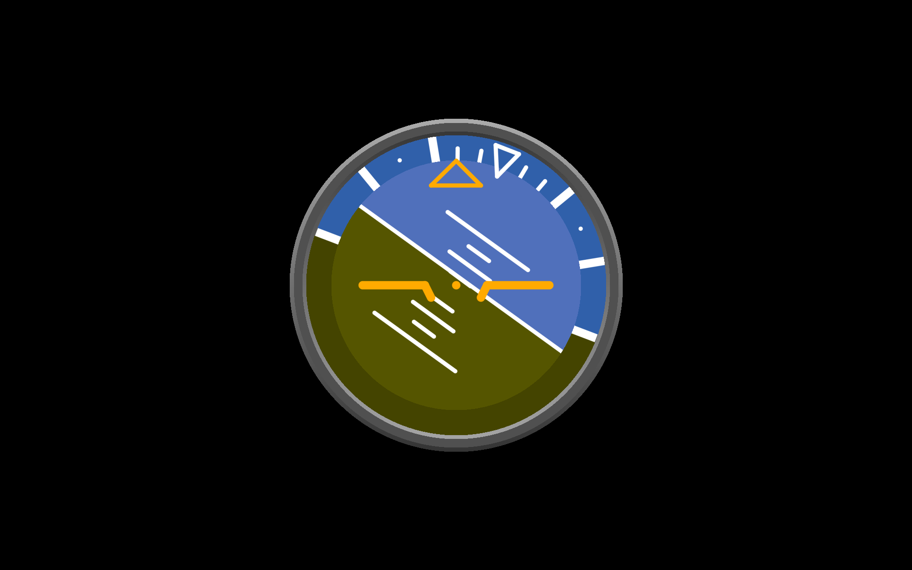

# Python BT82x Development Attitude Example

[Back](../README.md)

## Attitude Example

The `attitude.py` example demonstrates drawing multiple scissored areas, handling overlapped drawing, and gradients for skeuomorphism. 

The example is intended to show an aircraft attitude instrument with bank/roll and pitch displays. The physical control for this would be a gyroscopic device with rotating gimbals for pitch and roll.

The atttude drawing comprises four parts: the bezel which uses gradients to shade the outer and inner edges of the bezel; the bank/roll area which is the outer circle of the drawing; the pitch area which is the inner part; a reference overlay which is fixed in position. The stencilling is used to make sure that graphical elements of each part do not spill over into the other parts.



### Running the Example

The format of the command call is as follows:

_MPSSE example:_
```
python cruattitudeise.py --connector ft232h 
```

_FT4222 example in single mode (--mode 0):_

```
python attitude.py --connector ft4222module 

```

_FT4222 example in dual mode (--mode 1) or quad mode (--mode 2):_

```
python attitude.py --connector ft4222module --mode 2

```

## Files and Folders

The example contains a single file which comprises all the demo functionality.

| File/Folder | Description |
| --- | --- |
| [attitude.py](attitude.py) | Example source code file for the attitude demo |
| [docs](docs) | Documentation support files |
