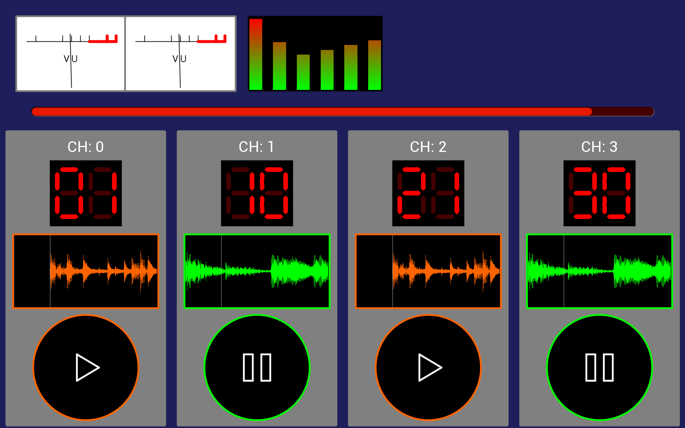

# Python BT82x Development Audioloop Example

[Back](../README.md)

## Audioloop Example

The `audioloop.py` example demonstrates drawing a multiple widgets and actions on the same screen while maintaining a high frame rate. The `audioloop.py` code uses the `vumeter.py` widget from the [snippets](../snippets) directory, the `ext-sevenseg` extension to draw seven segment displays, the `ext-plotgraph` extension to draw BARGRAPH bitmaps, and the `ext-memory` extension to manage memory allocation.

Four BARGRAPH bitmaps are used to render data into a scrolling area that simulates an audio signal, a pair of seven segment LEDs count up as the animation progresses. Two VU meters and a simulated EQ display are used to give another view of the simulated audio signal. Finally, a `CMD_GAUGE` control shows elapsed time while transitioning from green to red.

### Extension

In the `audioloop.py` program the `ext-sevenseg`, `ext-plotgraph`, and `ext-memory` extensions are loaded with the `extplotmemsevenseg` code. This loads the `CMD_SEVENSEG`, `CMD_MEMORYINIT`, `CMD_MEMORYBITMAP`, and `CMD_PLOTBITMAP` functions into the device. To verify the version of the extension loaded and the components the function the loader code for the `extplotmemsevenseg` returns a string containing information on the extension code. This is printed on the console when the extension is loaded:

```
print(extplotmemsevenseg.loadpatch(eve))
```
The return message is as follows:
```
plot6;plot-0.3;mem-0.1;7seg-0.1;
```
The name of the extension code is "plot6", it contains the ext-plotgraph extension version "0.3", the ext-memory extension "0.1", and the ext-sevenseg extension "0.1".



### Running the Example

The format of the command call is as follows:

_MPSSE example:_
```
python audioloop.py --connector ft232h 
```

_FT4222 example in single mode (--mode 0):_

```
python audioloop.py --connector ft4222module 

```

_FT4222 example in dual mode (--mode 1) or quad mode (--mode 2):_

```
python audioloop.py --connector ft4222module 

```

## Files and Folders

The example contains a single file which comprises all the demo functionality.

| File/Folder | Description |
| --- | --- |
| [audioloop.py](audioloop.py) | Example source code file |
| [docs](docs) | Documentation support files |
