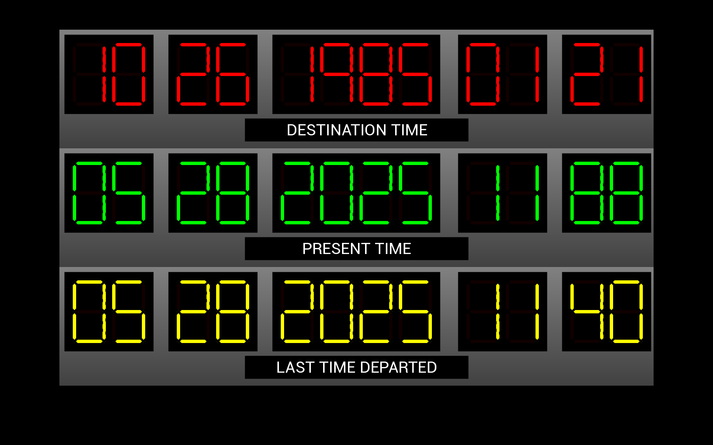

# Python BT82x Development Advanced Seven Segment Example

[Back](../README.md)

## Advanced Seven Segment Example

The `b2tf.py` and `b2tf2.py` examples demonstrate drawing a multiple seven segment displays on the same screen. The `b2tf.py` code uses the `sevensegment.py` widget from the [snippets](../snippets) directory to perform the drawing. The `b2tf2.py` performs the same task but uses the `ext-sevenseg` extension to draw the seven segment displays.

### Extension

The `ext-sevenseg` extension is loaded with the code in `patch_b2tf2.py`. This loads extension coprocessor commands including the `CMD_SEVENSEG` function into the device. To verify the version of the extension loaded and the components the function the loader code tests the return string containing information on the extension from the coprocessor.

The `patch_b2tf2.py` file is generated by EVE Asset Builder (EAB).



### Running the Example

The format of the command call is as follows:

_MPSSE example:_
```
python b2tf.py --connector ft232h 
```

_FT4222 example in single mode (--mode 0):_

```
python b2tf.py --connector ft4222module 

```

_FT4222 example in dual mode (--mode 1) or quad mode (--mode 2):_

```
python b2tf.py --connector ft4222module --mode 2

```

## Files and Folders

The example contains a single file which comprises all the demo functionality.

| File/Folder | Description |
| --- | --- |
| [b2tf.py](b2tf.py) | Example source code file using the sevensegment widget |
| [b2tf2.py](b2tf.py) | Example source code file using the  function |
| [sevensegment.py](../snippets/sevensegment.py) | Snippet source code for seven segment displays |
| [patch_b2tf2.py](patch_b2tf2.py) | Extension loader module from EAB |
| [docs](docs) | Documentation support files |
