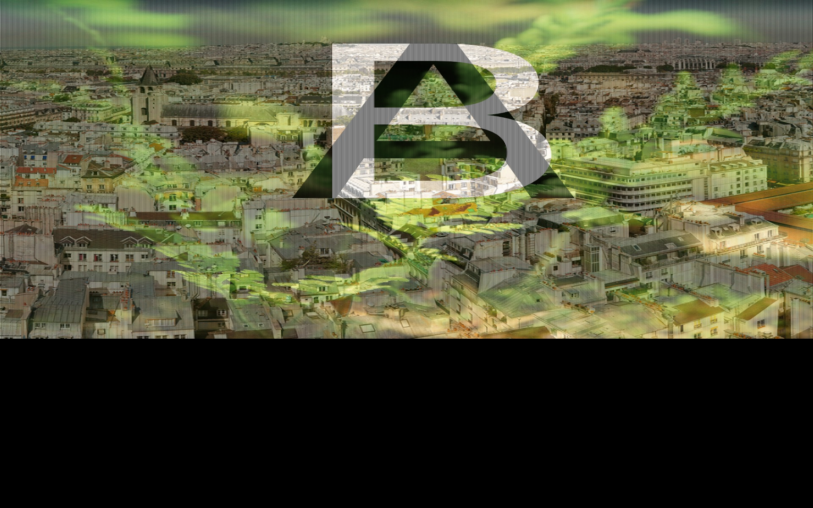
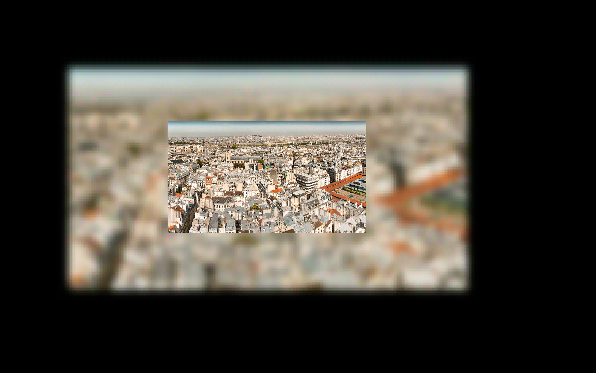
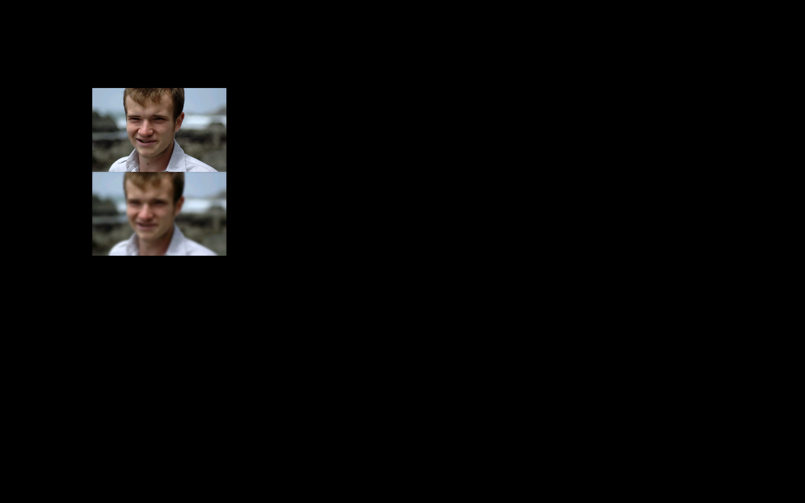

# Python BT82x Development Bitmap Example

[Back](../README.md)

## Bitmap Examples

The `bitmap-split.py` example demonstrates how to load a combined bitmap image, split it into two independent buffers and display them separately on the screen. This approach allows for efficient handling and display of large or composite images by dividing them into manageable sections, which can be useful for applications such as tiled graphics or multi-region displays.

The `bitmap-merge.py` example demonstrates how to combine two separate bitmap images into a single, larger image buffer for display. This approach is useful for applications that require assembling multiple graphics elements into a unified display buffer, such as creating composite backgrounds, dashboards, or tiled graphics for embedded systems.

The `bitmap-crop.py` example demonstrates how to load a bitmap image, crop a specific region from it, and prepare the cropped section for display or further processing it. This workflow enables efficient manipulation and display of only the desired part of an image, which is useful for applications that require focusing on or reusing specific image regions, such as icons, sprites, or UI elements in embedded graphics systems.

## Bitmap Blur Examples

With the "Blur Extension" added to the BT82x the CMD_BLURSCREEN/CMD_BLURDRAW and CMD_BLURIMAGE features can be used.

In `bitmap-blur.py` the example will draw an image to the screen, create a blurred image of the screen, draw that screen-sized blurred image as a background, then redraw a smaller version of the original bitmap image ontop. This is useful for making an interesting background for an announcement or image when the focus is needed in the foreground.

The `bitmap-blurimage.py` example will take a simple image and create another version of it which has been blurred. This second image is the same size as the first image and can be drawn and used as any bitmap. Note that there is an image size limit on the use of CMD_BLURIMAGE.

# Screen Display
bitmap-split


bitmap-merge


bitmap-crop


bitmap-blur


bitmap-blurimage


### Running the Example

The format of the command call to run `bitmap-split` is as follows:

MPSSE example
```
python localbbitmap-splitehavior1.py --connector ft232h
```
FT4222 example in single mode (--mode 0)
```
python bitmap-split.py --connector ft4222module

```
FT4222 example in dual mode (--mode 1) or quad mode (--mode 2)
```
python bitmap-split.py --connector ft4222module --mode 2

```

## Files and Folders

The example contains several files which comprises all the demo functionality.

| File/Folder | Description |
| --- | --- |
| [bitmap-split.py](bitmap-split.py) | Example source code file |
| [bitmap-merge.py](bitmap-merge.py) | Example source code file |
| [bitmap-crop.py](bitmap-crop.py) | Example source code file |
| [bitmap-blur.py](bitmap-blur.py) | Example source code file |
| [bitmap-blurimage.py](bitmap-blurimage.py) | Example source code file |
| [assets](assets) | Source bitmap for demo |
| [docs](docs) | Documentation support files |
