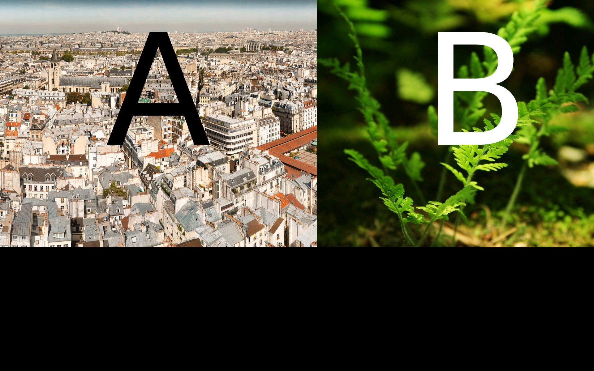
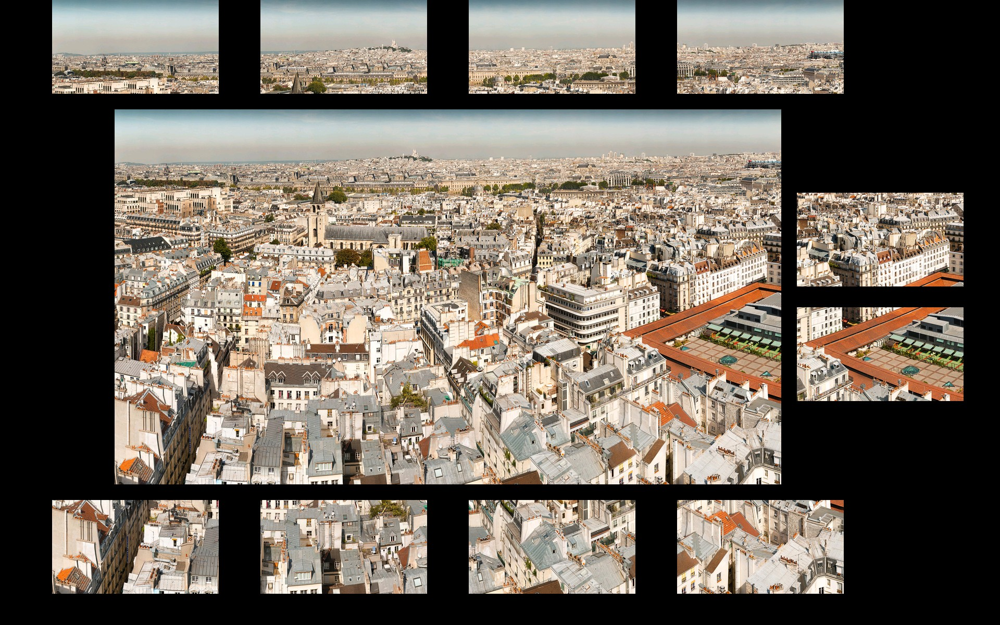

# Python BT82x Development Bitmap Example

[Back](../README.md)

## Bitmap Example

The `bitmap-split.py` example demonstrates how to load a combined bitmap image, split it into two independent buffers and display them separately on the screen. This approach allows for efficient handling and display of large or composite images by dividing them into manageable sections, which can be useful for applications such as tiled graphics or multi-region displays.

The `bitmap-crop.py` example demonstrates how to load a bitmap image, crop a specific region from it, and prepare the cropped section for display or further processing it. This workflow enables efficient manipulation and display of only the desired part of an image, which is useful for applications that require focusing on or reusing specific image regions, such as icons, sprites, or UI elements in embedded graphics systems.

# Screen Display
bitmap-split


bitmap-crop


### Running the Example

The format of the command call to run `bitmap-split` is as follows:

MPSSE example
```
python localbbitmap-splitehavior1.py --connector ft232h
```
FT4222 example in single mode (--mode 0)
```
python bitmap-split.py --connector ft4222module

```
FT4222 example in dual mode (--mode 1) or quad mode (--mode 2)
```
python bitmap-split.py --connector ft4222module --mode 2

```

## Files and Folders

The example contains two files which comprises all the demo functionality.

| File/Folder | Description |
| --- | --- |
| [bitmap-split.py](bitmap-split.py) | Example source code file |
| [bitmap-crop.py](bitmap-crop.py) | Example source code file |
| [assets](assets) | Source bitmap for demo |
| [docs](docs) | Documentation support files |
