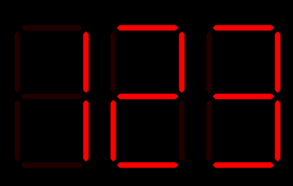
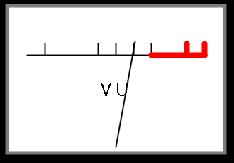

# Python BT82x Development Example Common Code

The `common` directory contains code that is used in the examples for the Python BT82x Development module. The following common code is available:

## Widgets

There are several widgets in the directory:

| File/Folder | Description |
| --- | --- |
| [sevensegment.py](sevensegment.py) | Seven segement LED code |
| [vumeter.py](vumeter.py) | VU meter code |

### Seven Segment LED Widget

This widget will simulate a 7 segment LED display. Active LEDs will be drawn in the foreground colour and inactive ones as the background. The digit to be displayed is sent in the range 0-16. For values 0 to 9 the decimal number is shown, for 10 to 15 the letters 'a' to 'f' are shown for hexadecimale displays, and for 16 a dash '-' is displayed.



_Calling format:_

   `sevenseg.cmd_sevenseg(eve, x, y, size, digit, fgcolour, bgcolour)`

_Parameters:_

-   **x,y**: Location of top left of the seven segment LED widget (in pixels).
-   **size**: Size of a segment of the seven segment LED widget (in pixels).
-   **digit**: Number to display on seven segment LED. 
-   **fgcolour**: Tuple with (R,G,B) colour for active segment.
-   **bgcolour**: Tuple with (R,G,B) colour for inactive segment.

_Example:_

```
sevensegment.cmd_sevenseg(eve, 200, 100, 90, int(number%10), (255, 0, 0), (32, 0, 0))
```

### VU Meter Widget

The VU Meter widget shows a simulation of an analogue level meter commonly found in Hi-Fi audio systems. It will have a FSD (Full Scale Deflection) of 255. It must be provided with the previous value that was returned from the widget to provide proper animation. 



_Calling format:_
   `vumeter.cmd_vumeter(eve, x, y, w, h, vu_level, vu_prev, border)`

_Parameters:_
-   **eve**: Handle to class of bteve2.
-   **x,y**: Location of top left of the VU Meter widget (in pixels).
-   **w,h**: Size of the VU Meter widget (in pixels).
-   **vu_level**: position of VU Meter dial. 0 to 255 (Full Scale Deflection)
-   **vu_prev**: previous position of VU Meter dial.
-   **border**: thickness of grey border around the VU Meter.

_Returns:_
   This returns the **vu_prev** value that must be passed the next time it is 
   called to ensure proper animated action.

_Example:_
```
vu_prev = None
while True:
    vu_level = getvu()
    vu_prev1 = vumeter.cmd_vumeter(eve, 100, 100, 300, 200, vu_level, vu_prev1, 5)
```

## Utilities

| File/Folder | Description |
| --- | --- |
| [screenshot.py](screenshot.py) | Utility to write a screenshot to an SD Card as a BMP file |
| [eveimagesize.py](eveimagesize.py) | Utility to determine the properties of a file before loading to EVE |

### Screenshot Utility

The screenshot utility can write a screenshot to an SD Card as a BMP file. It comprises two parts `setup` and `cmd_screenshot`.

Once the display to be captured is drawn into a display list then the cmd_screenshot function is called. This **MUST** be called after a `DISPLAY` command and before a `CMD_SWAP` command.

#### Screenshot Setup

The setup code must be called at some point before the display list to screenshot is drawn, it will load extension code to allow writing to the SD card. This will interfere with other patches that are loaded in the EVE device. The `ext-fssnapshot` extension can be added to a another patch that is loaded in the device.

_Calling format:_
   `screenshot.setup(eve)` 

_Parameters:_
-   **eve**: Handle to class of bteve2.

_Returns:_
   This returns the status from an SD card operation. A value of zero is success, any other value is a failure. SD card return values are decoded into strings in the `LIB_SDCARD_ERROR` function in the EVE module.

#### Screenshot Command

_Calling format:_
   `screenshot.cmd_screenshot(eve, filename)`

_Parameters:_
-   **eve**: Handle to class of bteve2.
-   **filename**: Filename to write BMP file to on SD card.

_Returns:_
   This returns the status from an SD card operation. A value of zero is success, any other value is a failure. SD card return values are decoded into strings in the `LIB_SDCARD_ERROR` function in the EVE module.

_Example:_
```
screenshot.setup(eve)
gd.CMD_DLSTART()
gd.CLEAR_COLOR_RGB(64,72,64)
gd.CLEAR(1,1,1)
drawscreen(gd)
gd.DISPLAY()
screenshot.cmd_screenshot(gd, "segments.bmp")
gd.CMD_SWAP()
gd.LIB_AWAITCOPROEMPTY()
```

### Image Size Utility

The eveimagesize utility will obtain the width, height and EVE image format of a PNG or JPG file before it is loaded into the device using `CMD_LOADIMAGE`. It can be used for sizing buffers to receive the image in RAM_G. 

_Calling format:_
   `eveimageproperties.get(eve, img_data)`

_Parameters:_
-   **eve**: Handle to class of bteve2.
-   **img_data**: array containing binary data from image file.

_Returns:_
   This returns a tuple with the width, height and imagetype. If the format is not supported then it will raise an exception.

_Example:_
```
with open("image.jpg", "rb") as file:
    img_data = file.read()
width,height,imagetype = eveimageproperties.get(eve, img_data)
```

## Extensions

TODO: