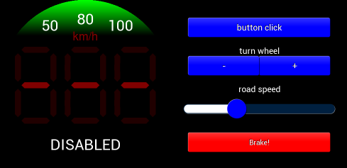

# Python BT82x Development Cruise Example

[Back](../README.md)

## Cruise Example

The `cruise.py` example demonstrates drawing multiple seven segment displays on the same screen, blending, scissoring, and trackers. The `cruise.py` code uses the `sevensegment.py` widget from the [snippets](../snippets) directory to perform some of the drawing. 

The example is intended to show a reimaginged cruise control for a vehicle. The physical control for which would be a rotating turn wheel (with presumably a shaft encoder), an integrated click button (the whole rotating wheel physically registers a press) and a touchscreen display. An external input would provide a signal for when the vehicle would disengage cruise control, e.g. when the brakes are depressed. The touchscreen would be overridden and disabled in software by the click button.

The display comprises two parts: the left side is a circular display which is the operational part of the touchscreen on the physical control; the right side are touchscreen controls to mimic the function of the turn wheel, button click and brake input.



### Running the Example

The format of the command call is as follows:

_MPSSE example:_
```
python cruise.py --connector ft232h 
```

_FT4222 example in single mode (--mode 0):_

```
python cruise.py --connector ft4222module 

```

_FT4222 example in dual mode (--mode 1) or quad mode (--mode 2):_

```
python cruise.py --connector ft4222module --mode 2

```

## Files and Folders

The example contains a single file which comprises all the demo functionality.

| File/Folder | Description |
| --- | --- |
| [cruise.py](cruise.py) | Example source code file for the cruise demo |
| [sevensegment.py](../snippets/sevensegment.py) | Snippet source code for seven segment displays |
| [docs](docs) | Documentation support files |
