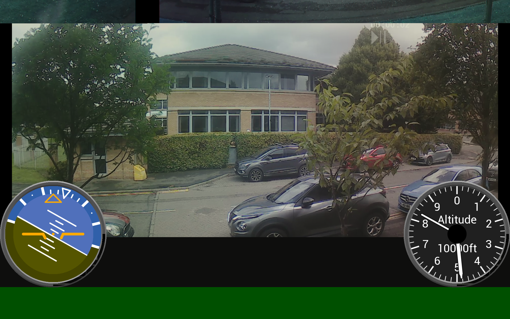

# Python BT82x Development Drone FP Video Example

[Back](../README.md)

## Drone FP Video Example

The `dronefpv.py` example demonstrates rendering an LVDS video input and overlaying animated controls ontop.

It uses the `eveflightcontrols.py` snippet to draw indicator dials on top of a video image from an HDMI source. **The LVDS input module is required.**




### Running the Example

The format of the command call is as follows:

_MPSSE example:_
```
python dronefpv.py --connector ft232h 
```

_FT4222 example in single mode (--mode 0):_

```
python dronefpv.py --connector ft4222module 

```

_FT4222 example in dual mode (--mode 1) or quad mode (--mode 2):_

```
python dronefpv.py --connector ft4222module --mode 2

```

## Files and Folders

The example contains a single file which comprises all the demo functionality.

| File/Folder | Description |
| --- | --- |
| [dronefpv.py](dronefpv.py) | Example source code file for the dronefpv demo |
| [eveflightcontrols.py](../snippets/eveflightcontrols.py) | Snippet source code for altitude and attitude indicators |
| [docs](docs) | Documentation support files |
