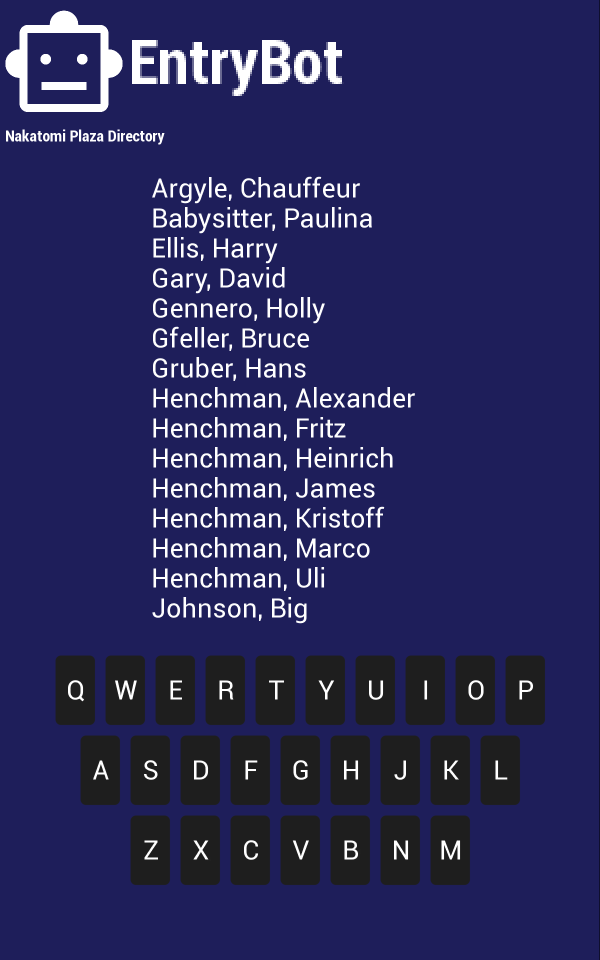
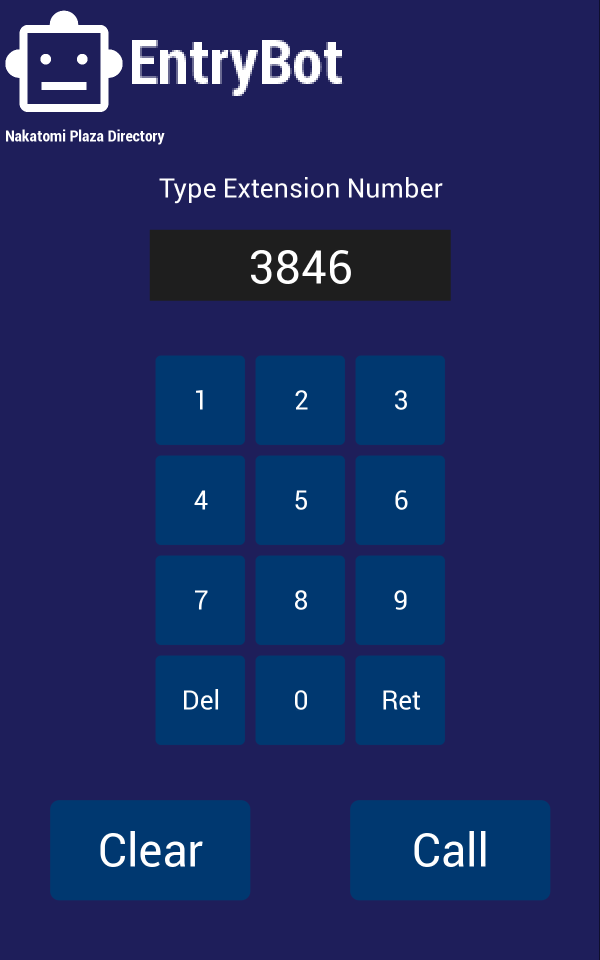

# Python BT82x Development EntryBot Example

[Back](../README.md)

## EntryBot Example

The `entrybot.py` example demonstrates:
- Use the memory extension to allocate memory for assets.
- Loading multiple images into a single bitmap handle and using the CELL command to access the desired image.
- Loading and swapping JPGs rapidly with CMD_LOADIMAGE to create an animation.
- Loading a custom relocatable font with the CMD_LOADASSET.
- Scroll text within a scissored area.
- Build a required "patch" of extensions and keep it up to date.
- Using the CMD_KEYBOARD extension, CMD_TEXTTICKET and CMD_TEXTSCALE commands from extensions.

There are 3 pages so far.

### Page 0


### Page 2



### Page 3



## Code Highlights

### Use of `memory` Extension

The `memory` extension allocates memory for the assets that are loaded into RAM_G.

If the font loaded is a relocatable asset then the CMD_LOADASSET is used to load the font to a 64 byte aligned address. JPG files are loaded to memory allocated as well.

All memory allocations can be affected by the built-in INFLATE engine. This will always pad to the end of the next 32 byte boundary.

## Multiple Images in CELLs

There are graphics images loaded into a single bitmap handle and addressed using a CELL command. A bitmap buffer large enough to hold all the images loaded this way is reserved with CMD_MEMORYBITMAP. The images are loaded in one-at-a-time into this buffer with the end of one image becoming the start of the next. All images must be identical in width, height and format.

### Swapping JPG Images

There are 2 buffers (CELLs) for loading JPG files into. The display list swaps between one and the other to display from one while the other is being loaded by the coprocessor. This stops the display showing partially loaded bitmaps.

### Scrolling Text

The scrolling text is made with SCISSOR_XY and SCISSOR_SIZE commands. Text is written at an offset to the start of the list so that the desired text is visible within the scissor area. An improvement would be to draw only the text that can appear within the bounds of the scissor area.

### Extensions

The `patchlink.py` or `patchlink.exe` program is used to rebuild an extension patch for the program. If the desired extensions passed to the `eveextension.py` module do not match the previously built extension patch then it will rebuild. Extensions can be added and removed with the module rebuilding the extension patch when needed.

## Running the Example

There are pages 0, 1 and 2 which access different points in the demo application. The page is selected with the `--page n` where *n* is the page number.

The format of the command call is as follows:

_MPSSE example:_
```
python entrybot.py --connector ft232h "simple program to write to the screen" --page 1
```

_FT4222 example in single mode (--mode 0):_

```
python entrybot.py --connector ft4222module "simple program to write to the screen" --page 1

```

_FT4222 example in dual mode (--mode 1) or quad mode (--mode 2):_

```
python entrybot.py --connector ft4222module "simple program to write to the screen" --page 0 --mode 2

```


## Files and Folders

The example contains a single file which comprises all the demo functionality.

| File/Folder | Description |
| --- | --- |
| [entrybot.py](entrybot.py) | Example source code file |
| [assets](assets) | Graphics and font assets |
| [extensions](extensions) | Extensions subsystem to create patches |
