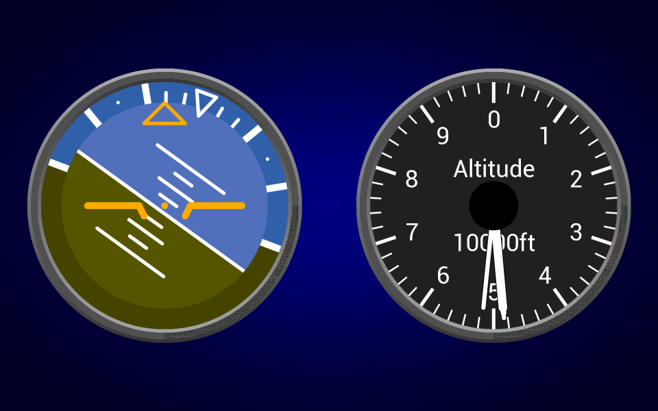

# Python BT82x Development Flightdeck Example

[Back](../README.md)

## Flightdeck Example

The `flightdeck.py` example demonstrates drawing multiple scissored areas, handling overlapped drawing, and gradients for skeuomorphism. 

The example is intended to show an aircraft attitude and altitude instruments. The attitude instrument has bank/roll and pitch displays. The physical control for this would be a gyroscopic device with rotating gimbals for pitch and roll. The altitude instrument has a graduations at 200ft and reads up to 10000ft. A real altritude gauge typically uses barometeric pressure.

The attitude drawing comprises four parts: the bezel which uses gradients to shade the outer and inner edges of the bezel; the bank/roll area which is the outer circle of the drawing; the pitch area which is the inner part; a reference overlay which is fixed in position. The stencilling is used to make sure that graphical elements of each part do not spill over into the other parts. The altitude drawing uses the same bezel method and internal graduation lines clipped with a stencil. The reading needle is outlined in a single pixel of black for clarity.



### Running the Example

The format of the command call is as follows:

_MPSSE example:_
```
python flightdeck.py --connector ft232h 
```

_FT4222 example in single mode (--mode 0):_

```
python flightdeck.py --connector ft4222module 

```

_FT4222 example in dual mode (--mode 1) or quad mode (--mode 2):_

```
python flightdeck.py --connector ft4222module --mode 2

```

## Files and Folders

The example contains a single file which comprises all the demo functionality.

| File/Folder | Description |
| --- | --- |
| [flightdeck.py](flightdeck.py) | Example source code file for the flightdeck demo |
| [docs](docs) | Documentation support files |
