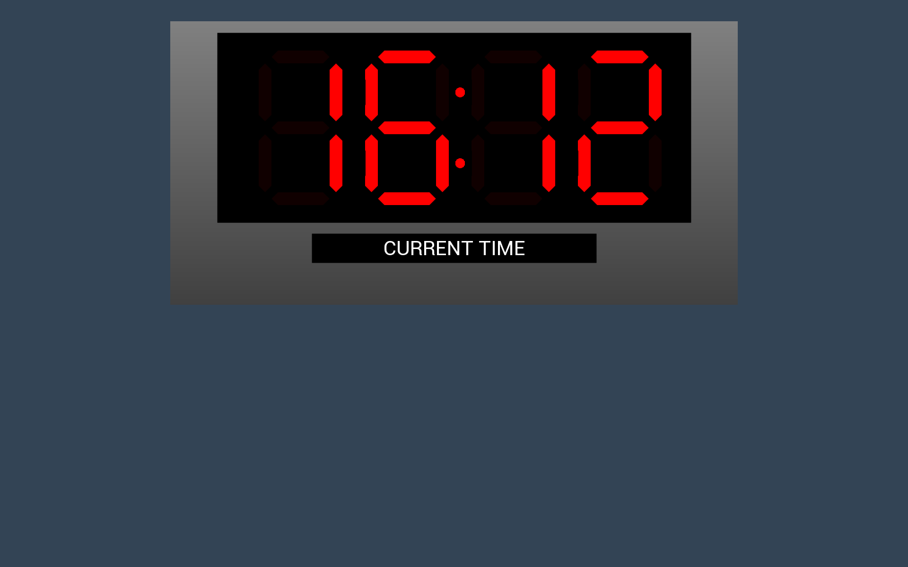

# Python BT82x Development LED Clock Example

[Back](../README.md)

## LED Clock Example

The program `ledclock.py` is included with uses the `sevensegment` snippet code to draw the LEDs. This does not support or show a time colon between the hours and minutes.

The `ledclock2.py` example demonstrates drawing multiple seven segment displays on the same screen. The script uses the `ext-sevenseg` extension to draw the seven segment displays. 

### Extension

The `ext-sevenseg` extension is loaded with the code in `patch_ledclock.py`. This loads extension coprocessor commands including the `CMD_SEVENSEG` function into the device. To verify the version of the extension loaded and the components the function the loader code tests the return string containing information on the extension from the coprocessor.

The `patch_ledclock.py` file is generated by EVE Asset Builder (EAB).



### Running the Example

The format of the command call is as follows:

_MPSSE example:_
```
python ledclock.py --connector ft232h 
```

_FT4222 example in single mode (--mode 0):_

```
python ledclock.py --connector ft4222module 

```

_FT4222 example in dual mode (--mode 1) or quad mode (--mode 2):_

```
python ledclock.py --connector ft4222module --mode 2

```

## Files and Folders

The example contains a single file which comprises all the demo functionality.

| File/Folder | Description |
| --- | --- |
| [ledclock2.py](ledclock.py) | Example source code file using extension patch code |
| [ledclock.py](ledclock.py) | Example source code file using seven segment snippet code |
| [patch_ledclock.py](patch_ledclock.py) | Extension loader module from EAB |
| [docs](docs) | Documentation support files |
