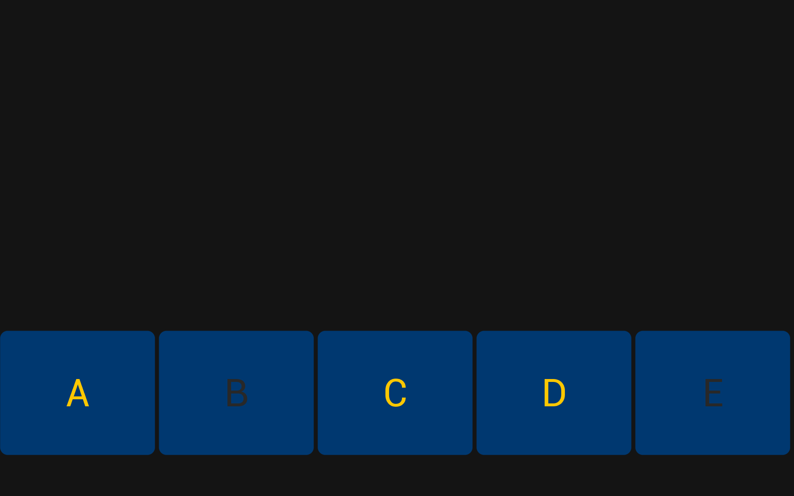
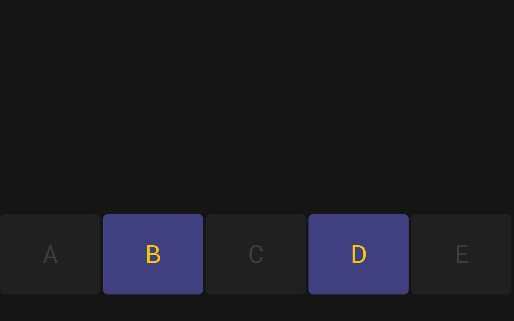

# Python BT82x Development localbehavior Example

[Back](../README.md)

## Localbehavior Example

The `localbehavior1.py` example sets up a watchdog timer and calibrates the touch with the display, then enters a loop where it manages the state of five on-screen buttons labeled "A" through "E." Each button is drawn at the bottom of the screen, and its color changes depending on whether it is toggled `on` or `off`. The example continuously checks for touch input using the `REG_TOUCH_TAG` register, and when a button is pressed, it toggles the corresponding state. The display is updated in real time to reflect any changes, providing an interactive user interface with five toggle buttons that respond to touch.

The `localbehavior2.py` defines a Builder class that helps construct a command buffer for the EVE graphics co-processor, allowing for conditional logic and control flow (like if/else/endif and loops) in the display list. In the `localbehavior_2` function, it sets up a watchdog timer and calibrates the touch with the display, then uses the Builder to create a display list that draws five toggle buttons labeled "A" through "E" at the bottom of the screen. The state of each button is stored in memory, and the button color changes based on its state. When a button is touched, its state toggles between `on` and `off`. The display list is written to the EVE device and executed in a loop. This display list is trigger by `CMD_CALLLIST` and provides an interactive UI with persistent button states managed in memory, similar to `localbehavior1.py` but implemented using a more advanced, buffer-based approach.

# Screen Display
localbehavior1


localbehavior2


### Running the Example

The format of the command call to run `localbehavior1` is as follows:

MPSSE example
```
python localbehavior1.py --connector ft232h
```
FT4222 example in single mode (--mode 0)
```
python localbehavior1.py --connector ft4222module

```
FT4222 example in dual mode (--mode 1) or quad mode (--mode 2)
```
python localbehavior1.py --connector ft4222module --mode 2

```

## Files and Folders

The example contains two files which comprises all the demo functionality.

| File/Folder | Description |
| --- | --- |
| [localbehavior1.py](localbehavior1.py) | Example source code file |
| [localbehavior2.py](localbehavior2.py) | Example source code file |
| [docs](docs) | Documentation support files |
