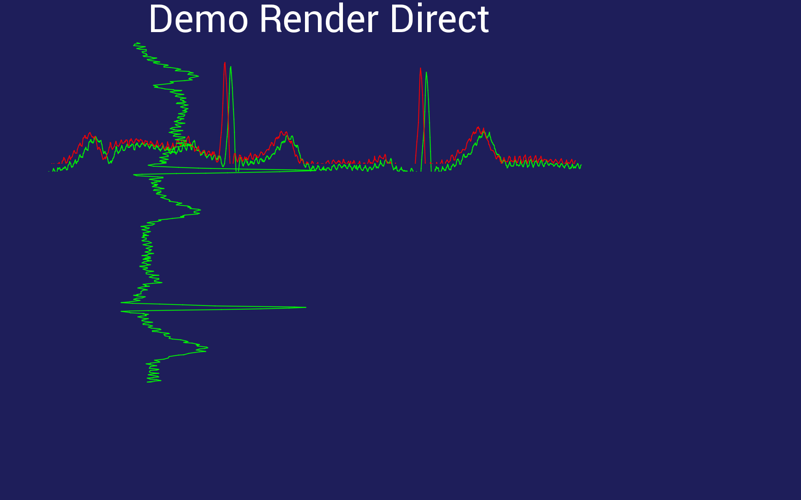

# Python BT82x Development Simple Plotting Example

[Back](../README.md)

## Simple Plotting Example

The `plottest.py` and `plottest2.py` examples demonstrate drawing a graph using the `ext-plotgraph` extension. 

The program `plottest.py` draws the graphs directly to the screen, whereas the `plottest2.py` code will render the graphs into a bitmap in RAM_G then display the bitmap afterwards.

The second program is useful for cases where an image may be rendered ahead of time by the BT82x and stored in RAM_G until it is required. This can save a lot of time if bitmap (or any other combinations of display list output) is static and can therefore be drawn once and used mulitple times. the CMD_RENDERTARGET is changed to draw the bitmap and then reverted to the original values when the graphs have been drawn into RAM_G.

### Extension

The `ext-plotgraph` extension is loaded with the `extplotmem` code. This loads the `cmd_plotdraw` function into the device. To verify the version of the extension loaded and the components the function the loader code for the `extplotmem` returns a string containing information on the extension code. This is printed on the console when the extension is loaded:

```
print(extplotmem.loadpatch(eve))
```
The return message is as follows:
```
plot6;plot-0.3;mem-0.1;
```
The name of the extension code is "plot6", it contains the ext-plotgraph extension version "0.3" and the ext-memory extension "0.1".



### Running the Example

The format of the command call is as follows:

_MPSSE example:_
```
python plottest.py --connector ft232h 
```

_FT4222 example in single mode (--mode 0):_

```
python plottest.py --connector ft4222module 

```

_FT4222 example in dual mode (--mode 1) or quad mode (--mode 2):_

```
python plottest.py --connector ft4222module --mode 2

```

The number in the command line is used as a decimal number to display in the widgets.

## Files and Folders

The example contains a single file which comprises all the demo functionality.

| File/Folder | Description |
| --- | --- |
| [segment.py](segment.py) | Example source code file |
| [docs](docs) | Documentation support files |
