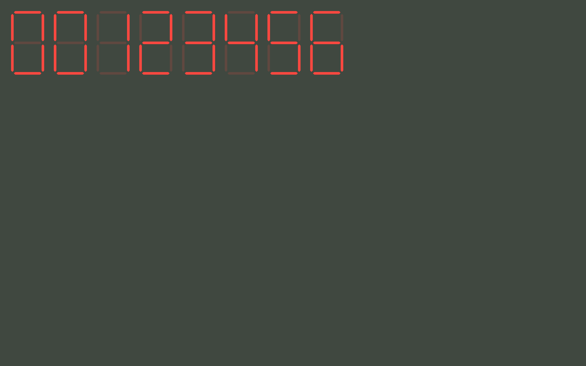

# Python BT82x Development Segment Example

[Back](../README.md)

## Segment Example

The `segment.py` example demonstrates writing a number to the screen using the `sevensegment` widget. See [common](../common/README.md) files documentation. It parses arguments and uses them to determine the display list for the BT82x.

The demo will draw 8 LED seven segment widgets on the BT82x screen displaying the decimal number passed in the command line and draw the widget with the size set in the `--size` parameter. Up to 8 decimals are displayed, the number is zero-padded.



### Running the Example

The format of the command call is as follows:

_MPSSE example:_
```
python segment.py --connector ft232h 123456 --size 100
```

_FT4222 example in single mode (--mode 0):_

```
python segment.py --connector ft4222module 123456 --size 100

```

_FT4222 example in dual mode (--mode 1) or quad mode (--mode 2):_

```
python segment.py --connector ft4222module 123456 --size 100 --mode 2

```

The number in the command line is used as a decimal number to display in the widgets.

## Files and Folders

The example contains a single file which comprises all the demo functionality.

| File/Folder | Description |
| --- | --- |
| [segment.py](segment.py) | Example source code file |
| [docs](docs) | Documentation support files |
