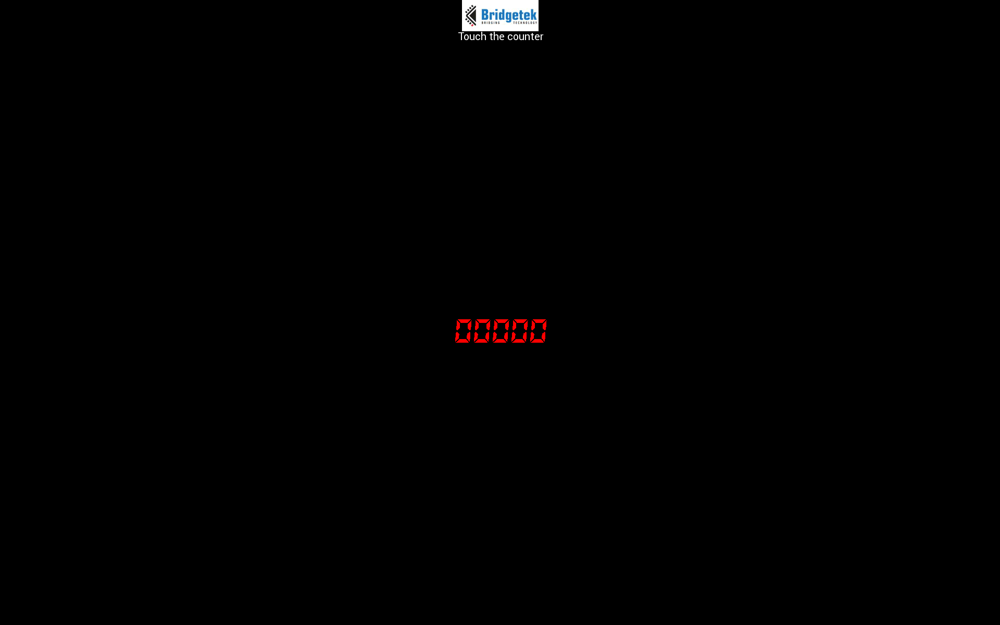

# Python BT82x Development Simple Example

[Back](../README.md)

## Simple Example

The `simple.py` example demonstrates using a custom font and loading a JPG image in a program. The custom font and the image are loaded to RAM_G and display using font/bitmap handles. The data for the font and the image are stored as python byte arrays and loaded using the coprocessor. The image is in JPG format and is decoded using the CMD_LOADIMAGE command.

## Simple2 Example
The `simple2.py` example demonstrates that instead of repeatedly sending the entire display list as `simple.py` example, it uses `CMD_COPYLIST`, `CMD_CALLLIST` and a small list that includes only `CMD_SWAP` to detect `REG_TOUCH_TAG` value. A full display list is sent again only when a valid `REG_TOUCH_TAG` value is detected.

# Screen Display


### Running the Example

The format of the command call is as follows:

_MPSSE example:_
```
python simple.py --connector ft232h 
```

_FT4222 example in single mode (--mode 0):_

```
python simple.py --connector ft4222module 

```

_FT4222 example in dual mode (--mode 1) or quad mode (--mode 2):_

```
python simple.py --connector ft4222module --mode 2

```

## Files and Folders

The example contains four files which comprises all the demo functionality.

| File/Folder | Description |
| --- | --- |
| [simple.py](simple.py) | Example source code file |
| [simple2.py](simple2.py) | Example source code file |
| [simplefont.py](simplefont.py) | Example source code file containing the custom font data and upload code |
| [simpleimage.py](simpleimage.py) | Example source code file containing the Bridgetek logo and upload code |
| [docs](docs) | Documentation support files |
