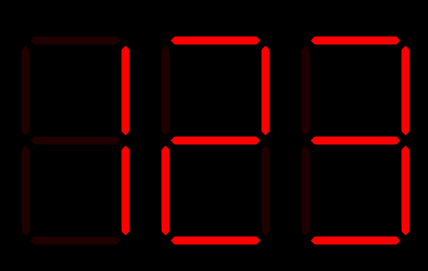
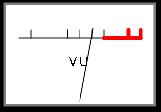
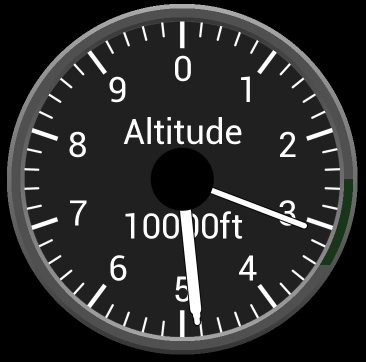
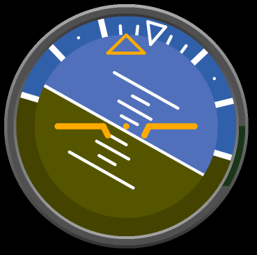

# Python BT82x Development Example Code Snippets

[Back](../README.md)

The `snippets` directory contains code that is used in the examples for the Python BT82x Development module. The following code is available in that directory:

## Contents

- [Widgets](#widgets)
  - [Seven Segment LED Widget](#Seven-Segment-LED-Widget)
  - [VU Meter Widget](#vu-meter-widget)
  - [Flight Control Widgets](#flight-control-widgets)
- [Utilities](#utilities)
  - [Screenshot Utility](#python-screenshot-utility)
  - [Image Size Utility](#python-image-size-utility)

## Widgets

There are several widgets in the directory:

| File/Folder | Description |
| --- | --- |
| [sevensegment.py](#Seven-Segment-LED-Widget) | Seven segement LED code |
| [vumeter.py](#vu-meter-widget) | VU meter code |
| [eveflightcontrols.py](#flight-control-widgets) | Flight control code |

### Seven Segment LED Widget

This widget will simulate a 7 segment LED display. Active LEDs will be drawn in the foreground colour and inactive ones as the background. The digit to be displayed is sent in the range 0-16. For values 0 to 9 the decimal number is shown, for 10 to 15 the letters 'a' to 'f' are shown for hexadecimale displays, and for 16 a dash '-' is displayed.



The Seven Segment LED is drawn using "blend" functions to produce clean anti-alised lines. It therefore works best on dark bachgrounds as the colours for the LEDs are built-up ontop of the background colour.

_Calling format:_

   `sevenseg.cmd_sevenseg(eve, x, y, size, digit, fgcolour, bgcolour)`

_Parameters:_

-   **x,y**: Location of top left of the seven segment LED widget (in pixels).
-   **size**: Size of a segment of the seven segment LED widget (in pixels).
-   **digit**: Number to display on seven segment LED. 
-   **fgcolour**: Tuple with (R,G,B) colour for active segment.
-   **bgcolour**: Tuple with (R,G,B) colour for inactive segment.

_Example:_

```
sevensegment.cmd_sevenseg(eve, 200, 100, 90, int(number%10), (255, 0, 0), (32, 0, 0))
```

### VU Meter Widget

The VU Meter widget shows a simulation of an analogue level meter commonly found in Hi-Fi audio systems. It will have a FSD (Full Scale Deflection) of 255. It must be provided with the previous value that was returned from the widget to provide proper animation. 



_Calling format:_
   `vumeter.cmd_vumeter(eve, x, y, w, h, vu_level, vu_prev, border)`

_Parameters:_
-   **eve**: Handle to class of bteve2.
-   **x,y**: Location of top left of the VU Meter widget (in pixels).
-   **w,h**: Size of the VU Meter widget (in pixels).
-   **vu_level**: position of VU Meter dial. 0 to 255 (Full Scale Deflection)
-   **vu_prev**: previous position of VU Meter dial.
-   **border**: thickness of grey border around the VU Meter.

_Returns:_
   This returns the **vu_prev** value that must be passed the next time it is 
   called to ensure proper animated action.

_Example:_
```
vu_prev = None
while True:
    vu_level = getvu()
    vu_prev1 = vumeter.cmd_vumeter(eve, 100, 100, 300, 200, vu_level, vu_prev1, 5)
```

### Flight Control Widgets

These widgets will simulate an aeroplane altitude indicator and attitude indicator. The file has both indicators included.

#### Flight Control Altitude Indicator

This is a simulation of an altitude indicator. It reads from zero to 10000 feet. It has 2 hands measuring thousands and hundreds of feet.

The altitude is specified in the call. It is clamped to 0 to 10000 feet as a real-life altitude indicator would.



_Calling format:_

   `eveflightcontrols.altwidget(eve, x, y, radius, alt)`

_Parameters:_

-   **x,y**: Location of the centre of the widget (in pixels).
-   **radius**: Radius of the widget dial (in pixels).
-   **alt**: Altitude to render.

_Example:_

```
eveflightcontrols.altwidget(eve, 300, 300, 200, 4382)
```

#### Flight Control Attitude Indicator

This is a simulation of an attitude indicator. It displays pitch, roll and climb.

The pitch, roll and climb are specified in the call and are in degrees. The range of pitch and climb must be between -90 degrees and + 90 degrees. Roll may be between -180 degrees and +180 degrees. 



_Calling format:_

   `eveflightcontrols.attwidget(eve, x, y, radius, pitch, climb, roll)`

_Parameters:_

-   **x,y**: Location of the centre of the widget (in pixels).
-   **radius**: Radius of the widget dial (in pixels).
-   **pitch**: Pitch angle in degrees.
-   **climb**: Climb angle in degrees.
-   **roll**: Roll angle in degrees.

_Example:_

```
eveflightcontrols.altwidget(eve, 300, 300, 200, +5, -10, -30)
```

## Python Utilities

| File/Folder | Description |
| --- | --- |
| [evescreenshot.py](#python-screenshot-utility) | Utility to generate a screenshot as a BMP file which can be written to a file on the host PC |
| [eveimagesize.py](#python-image-size-utility) | Utility to determine the properties of a file before loading to EVE |

### Python Screenshot Utility

A python screenshot utility `evescreenshot.py` can write a screenshot to a file on the host PC as a BMP file. It comprises a single function `cmd_screenshot`.

Once the display to be captured is drawn into a display list then the cmd_screenshot function is called. This **MUST** be called after a `DISPLAY` command and before a `CMD_SWAP` command.

#### Screenshot Command

_Calling format:_
   `evescreenshot.cmd_screenshot(eve, filename)`

_Parameters:_
-   **eve**: Handle to class of bteve2.
-   **filename**: Filename to write BMP file to on host PC.

_Returns:_
   There is no return value. An exception will be raised if the file cannot be opened.

_Example:_
```
import evescreenshot

eve.LIB_BeginCoProList()
eve.CMD_DLSTART()
eve.CLEAR_COLOR_RGB(64,72,64)
eve.CLEAR(1,1,1)
drawscreen(eve)
eve.DISPLAY()
evescreenshot.cmd_screenshot(eve, "segments.bmp")
eve.CMD_SWAP()
eve.LIB_EndCoProList()
eve.LIB_AwaitCoProEmpty()
```

### Python Image Size Utility

The eveimagesize utility will obtain the width, height and EVE image format of a PNG or JPG file before it is loaded into the device using `CMD_LOADIMAGE`. It can be used for sizing buffers to receive the image in RAM_G. 

_Calling format:_
   `eveimageproperties.get(eve, img_data)`

_Parameters:_
-   **eve**: Handle to class of bteve2.
-   **img_data**: array containing binary data from image file.

_Returns:_
   This returns a tuple with the width, height and imagetype. If the format is not supported then it will raise an exception.

_Example:_
```
import eveimageproperties

with open("image.jpg", "rb") as file:
    img_data = file.read()
width,height,imagetype = eveimageproperties.get(eve, img_data)
```
