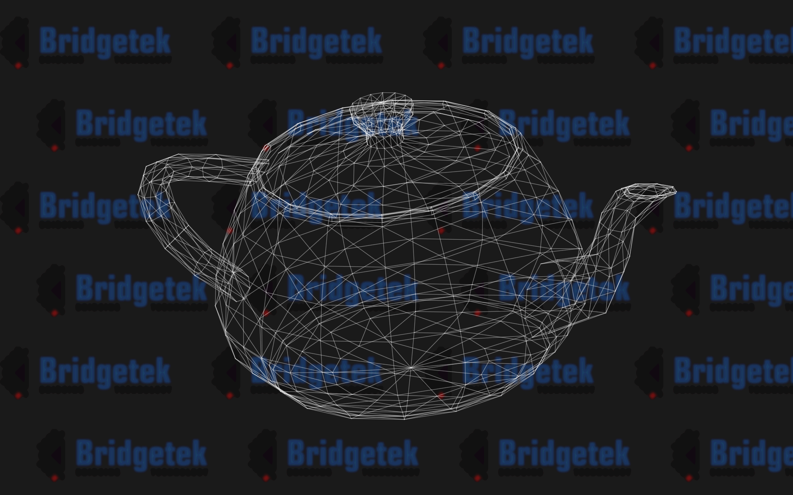

# Python BT82x Development Teapot Example

[Back](../README.md)

## Teapot Example

The `teapot.py` example demonstrates using an additional display list in RAM_G and loading this into the render display list using the CMD_NEWLIST/CMD_ENDLIST commands to direct the coprocessor to write the display list to RAM_G rather than the render display list. Later in the code the coprocessor receives a CMD_CALLLIST command which will load the list from RAM_G.

This method is useful in the case where a part of display list is repeated or can be pre-rendered. The new list can be modular and used several times in the main code - the list could be written in such a way to repeat a widget several times on the screen where the start of the widget would be set by a VERTEX_TRANSLATE_X/VERTEX_TRANSLATE_Y in the main code to set the position.



_Example code running._

This example works by creating a fixed size display list in RAM_G continaing VERTEX2F commands for each of the points in the teapot wire frame. To animate the teapot the list is modified by overwriting the list in RAM_G with new VERTEX2F commands before the coprocessor is asked to copy these into the render display list using a CMD_CALLLIST.

A "floating" image is loaded in the background which is also animated using a BITMAP_TRANSFORM_C which can move the image on the horizontal axis.

### Running the Example

The format of the command call is as follows:

_MPSSE example:_
```
python teapot.py --connector ft232h 
```

_FT4222 example in single mode (--mode 0):_

```
python teapot.py --connector ft4222module 

```

_FT4222 example in dual mode (--mode 1) or quad mode (--mode 2):_

```
python teapot.py --connector ft4222module 

```

## Files and Folders

The example contains a single file which comprises all the demo functionality. Additional resources for the demo are in the assets directory

| File/Folder | Description |
| --- | --- |
| [teapot.py](teapot.py) | Example source code file |
| [assets](assets) | Geometry and logos for demo |
| [docs](docs) | Documentation support files |
