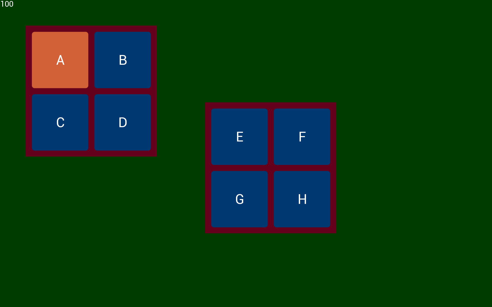

# Python BT82x Development Touch-offset Example

[Back](../README.md)

## Touch-offset Example

The `touchoffset.py` example demonstrates interactive touch handling and rendering using Bridgetek EVE chip. It defines a Subwindow class that displays button groups on separate surfaces, manages touch highlighting, and uses EVE commands to render graphics and handle touch offsets. The main loop alternates between two subwindows, updating the display and tracking touch events, while efficiently managing frame rendering and swap chains. This example is to showcase touch offset and button interaction features on EVE chip.

# Screen Display


### Running the Example

The format of the command call is as follows:

MPSSE example
```
python touchoffset.py --connector ft232h
```
FT4222 example in single mode (--mode 0)
```
python touchoffset.py --connector ft4222module

```
FT4222 example in dual mode (--mode 1) or quad mode (--mode 2)
```
python touchoffset.py --connector ft4222module --mode 2

```

## Files and Folders

The example contains a single file which comprises all the demo functionality.

| File/Folder | Description |
| --- | --- |
| [touchoffset.py](touchoffset.py) | Example source code file |
| [docs](docs) | Documentation support files |
