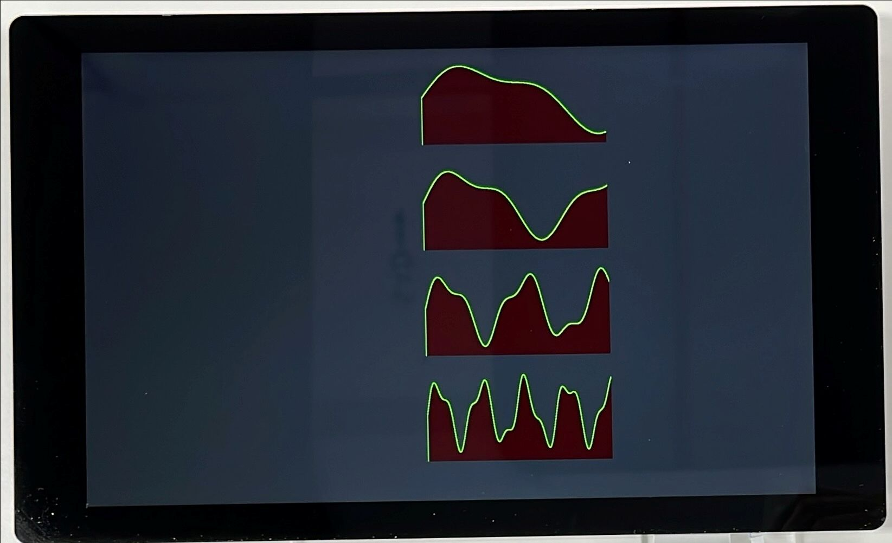

# Python BT82x Development Simple Example

The `tsd.py` example demonstrates Time-series data live display, using HISTOGRAM and display four live graphs on the screen.

The format of the command call is as follows:

MPSSE example
```
python tsd.py --connector ft232h
```
FT4222 example in single mode (--mode 0)
```
python tsd.py --connector ft4222module

```
FT4222 example in dual mode (--mode 1) or quad mode (--mode 2)
```
python tsd.py --connector ft4222module --mode 2

```

# Screen Display

