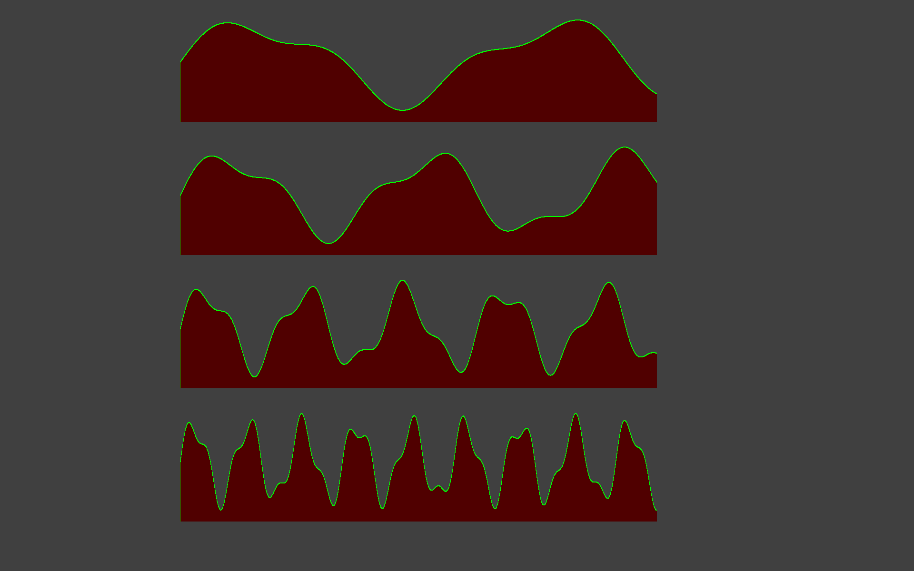

# Python BT82x Development Time-Series Data Example

[Back](../README.md)

## Time-Series Data Example

The `tsd.py` example demonstrates Time-Series data live display, using HISTOGRAM and display four live graphs on the screen. In the tsd() function, four chart objects are created. Each with its own memory region. In the loop, it generates four synthetic sinewave signals, updates each chart with new data points, and redraws the screen with the updated charts.

# Screen Display


### Running the Example

The format of the command call is as follows:

MPSSE example
```
python tsd.py --connector ft232h
```
FT4222 example in single mode (--mode 0)
```
python tsd.py --connector ft4222module

```
FT4222 example in dual mode (--mode 1) or quad mode (--mode 2)
```
python tsd.py --connector ft4222module --mode 2

```

## Files and Folders

The example contains a single file which comprises all the demo functionality.

| File/Folder | Description |
| --- | --- |
| [tsd.py](tsd.py) | Example source code file |
| [docs](docs) | Documentation support files |
